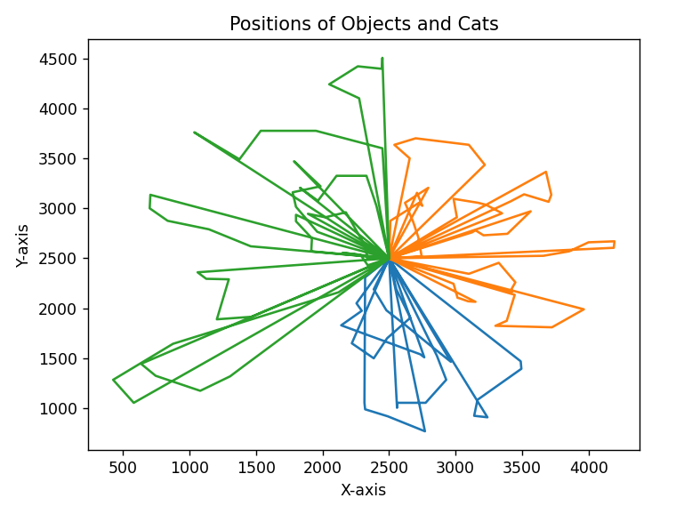

# Zadanie 4

## Opis działania algorytmu
Losow generowane są obiekty.  
Pierw poluje Luna przez 2h, następnie Adriana i Dante.  
Żeby ścieżki się nie krzyżowały, każdemu kotu został przydzielony odgórnie obszar do polowania. Obszar zawsze wygląda tak samo, lecz dobór obszaru do konkretnego kota jest dobierany przez obliczaną średnią wartość obiektów na danym obszarze.  
Każdy kot zawszy wybiera zachłannie najcenniejszy obiekt.
## Wizualiacja ścieżek kotów

